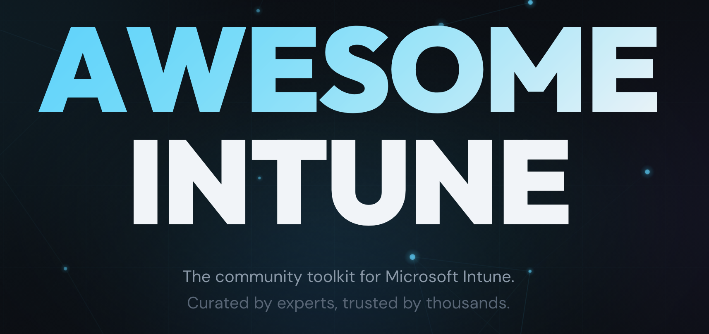

<div align="center">

# Awesome Intune

**The community toolkit for Microsoft Intune**

*Curated by experts, trusted by thousands.*

[](https://github.com/ugurkocde/awesomeintune/stargazers)
[](https://github.com/ugurkocde/awesomeintune/network/members)
[](LICENSE)
[](https://github.com/ugurkocde/awesomeintune/commits/main)
[](https://awesomeintune.com)

<br />

<a href="https://awesomeintune.com">
  
</a>

<br />
<br />

[**Visit Awesome Intune**](https://awesomeintune.com) | [Submit a Tool](https://awesomeintune.com/submit) | [Browse Categories](https://awesomeintune.com)

</div>

---

## About

Awesome Intune is a community-curated collection of the best tools, scripts, and resources for Microsoft Intune professionals. Whether you're troubleshooting device sync issues, automating policy deployments, or packaging applications, you'll find the right tool here.

**Key Highlights:**
- **AI-Powered Search** - Describe your problem in plain language and find the right tool instantly
- **40+ Curated Tools** - Handpicked by the community, vetted for quality
- **Always Growing** - New tools added regularly through community submissions

---

## Features

| Feature | Description |
|---------|-------------|
| **Semantic Search** | Find tools by describing what you need - our AI understands context |
| **Smart Filtering** | Filter by category and tool type to narrow down results |
| **Screenshot Galleries** | See tools in action before you download |
| **Tool Details** | GitHub stats, author info, and direct download links |
| **Email Notifications** | Subscribe to get notified when new tools are added |
| **Community Driven** | Anyone can submit tools through our simple form |

---

## Categories

Explore tools organized by what you're trying to accomplish:

| Category | Description |
|----------|-------------|
| **Reporting** | Generate reports on devices, policies, compliance, and deployments |
| **Automation** | Automate repetitive Intune tasks and workflows |
| **Packaging** | Create and manage Win32 apps, MSIX, and deployment packages |
| **Troubleshooting** | Debug sync issues, policy conflicts, and enrollment problems |
| **Security** | Manage security baselines, compliance, and threat protection |
| **Configuration** | Deploy and manage device configurations at scale |
| **Monitoring** | Track device health, app installations, and policy status |
| **Migration** | Migrate from other MDM solutions or between tenants |
| **Other** | Additional tools that don't fit neatly into other categories |

---

## Tool Types

Tools come in various formats to fit your workflow:

- **PowerShell Module** - Install via PowerShell Gallery, import and use
- **PowerShell Script** - Standalone scripts for specific tasks
- **Web App** - Browser-based tools accessible anywhere
- **Desktop App** - Native applications for Windows/Mac
- **Browser Extension** - Enhance your Intune portal experience
- **CLI Tool** - Command-line utilities for automation
- **API Wrapper** - Libraries for programmatic Intune access
- **Documentation** - Guides, references, and learning resources

---

## Submit a Tool

Have a tool that should be listed? There are two ways to submit:

### Option 1: Web Form (Recommended)

Visit [awesomeintune.com/submit](https://awesomeintune.com/submit) and fill out the submission form. Your submission will create a GitHub issue for review.

### Option 2: GitHub Issue

Create a new issue using our [tool submission template](https://github.com/ugurkocde/awesomeintune/issues/new?template=tool-submission.yml).

### Review Process

1. Submit your tool via web form or GitHub issue
2. Community members and maintainers review the submission
3. Once approved, the tool is added to the collection
4. You'll be notified when your tool goes live

---

## Tool Data Structure

Tools are stored as JSON files in the `/data/tools/` directory. Each tool follows this structure:

<details>
<summary>View JSON Schema</summary>

```json
{
  "id": "tool-name-kebab-case",
  "name": "Tool Display Name",
  "description": "A clear description of what the tool does and why it's useful.",
  "keywords": ["search", "terms", "for", "discovery"],
  "author": "Author Name",
  "authorPicture": "https://github.com/username.png",
  "githubUrl": "https://github.com/username",
  "linkedinUrl": "https://linkedin.com/in/username",
  "xUrl": "https://x.com/username",
  "repoUrl": "https://github.com/username/repo",
  "downloadUrl": "https://powershellgallery.com/packages/ToolName",
  "websiteUrl": "https://tool-website.com",
  "category": "troubleshooting",
  "type": "powershell-module",
  "dateAdded": "2024-01-15"
}
```

**Field Reference:**

| Field | Required | Description |
|-------|----------|-------------|
| `id` | Yes | Unique identifier in kebab-case |
| `name` | Yes | Display name of the tool |
| `description` | Yes | What the tool does (be descriptive) |
| `keywords` | No | Array of search terms |
| `author` | Yes | Creator's name |
| `authorPicture` | No | URL to author's avatar |
| `githubUrl` | No | Author's GitHub profile |
| `linkedinUrl` | No | Author's LinkedIn profile |
| `xUrl` | No | Author's X/Twitter profile |
| `repoUrl` | Yes | Repository URL |
| `downloadUrl` | No | Direct download or install link |
| `websiteUrl` | No | Project website |
| `category` | Yes | One of the 9 categories |
| `type` | Yes | One of the 8 tool types |
| `dateAdded` | Yes | Date added (YYYY-MM-DD) |

</details>

---

## Contributing

We welcome contributions! Here's how you can help:

### Adding a Tool Manually

1. Fork the repository
2. Create a new JSON file in `/data/tools/` (use the template above)
3. Optionally add screenshots to `/public/screenshots/{tool-id}/`
4. Submit a pull request

### Development Setup

```bash
# Clone your fork
git clone https://github.com/YOUR_USERNAME/awesomeintune.git
cd awesomeintune

# Install dependencies
npm install

# Start development server
npm run dev
```

### Available Scripts

| Command | Description |
|---------|-------------|
| `npm run dev` | Start development server with hot reload |
| `npm run build` | Build for production |
| `npm run start` | Start production server |
| `npm run lint` | Run ESLint |
| `npm run typecheck` | Run TypeScript type checking |

---

## Tech Stack

Built with modern technologies for performance and developer experience:

- **Framework:** Next.js 15, React 19, TypeScript
- **Styling:** Tailwind CSS, Framer Motion
- **Backend:** Supabase (database), OpenAI (search), Resend (email)
- **Deployment:** Vercel

---

## License

This project is licensed under the **GNU Affero General Public License v3.0** (AGPL-3.0).

This means:
- You can use, modify, and distribute this software
- If you modify and deploy it as a service, you must make your source code available
- Any modifications must also be licensed under AGPL-3.0

See the [LICENSE](LICENSE) file for full details.

---

## Acknowledgments

Awesome Intune exists because of the incredible Microsoft Intune community. Thank you to:

- Every tool author who builds solutions that make our work easier
- Contributors who submit tools, report issues, and improve the site
- The Intune community for sharing knowledge and helping each other

---

<div align="center">

**[Visit Awesome Intune](https://awesomeintune.com)**

If you find this project useful, please consider giving it a star.

</div>
